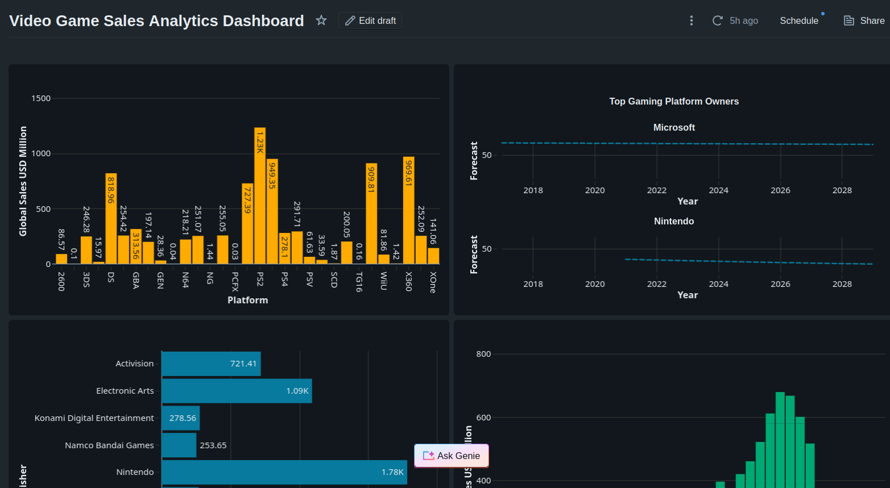
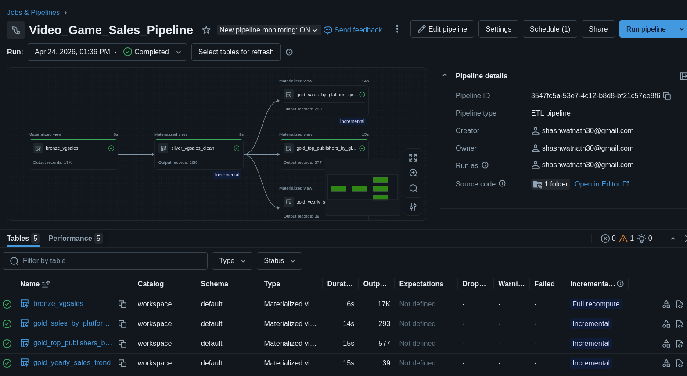
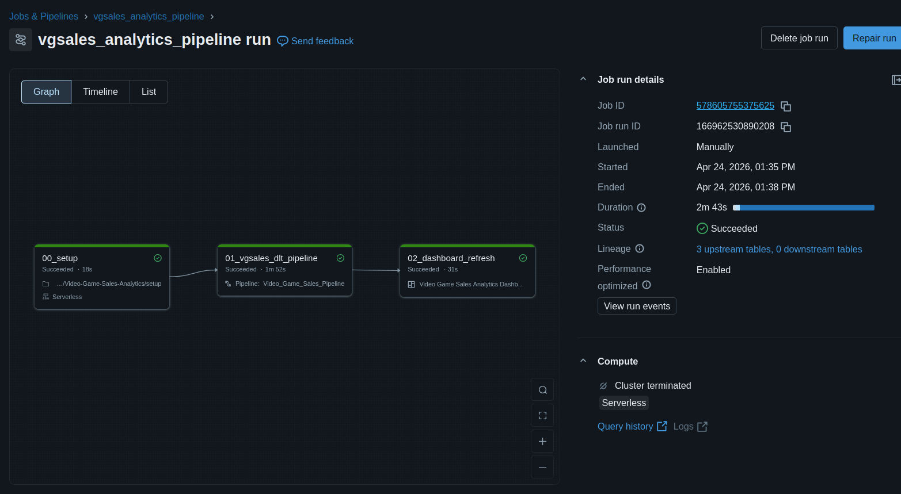

# Video Game Sales Analytics & AI Forecasting 🎮📊

An end-to-end Data Engineering and Machine Learning project built on **Databricks**. This project ingests scraped video game sales data, processes it through a Medallion Architecture using **Delta Live Tables (DLT)**, and serves the cleaned data for a BI Dashboard and an AI-driven forecasting model.

## 🚀 Project Overview

This repository contains the infrastructure and pipeline code to transform raw, scraped `.csv` data into actionable, business-ready insights. The pipeline ensures data quality, schema enforcement, and automated orchestration, ultimately powering:
1. **Executive Dashboards:** Visualizing global sales distribution by platform, genre, and publisher.
2. **AI Forecasting:** Predicting future market trends and sales trajectories based on historical release data.

### 🛠️ Tech Stack
* **Compute & Orchestration:** Databricks, Databricks Workflows (Jobs)
* **Data Processing:** PySpark, Delta Live Tables (DLT)
* **Storage:** Delta Lake (Bronze, Silver, Gold layers)
* **CI/CD:** Git-based ETL deployment
* **Downstream:** Databricks SQL Dashboards, ML/AI Forecasting

---

## 🏗️ Architecture & Pipeline Flow

The pipeline strictly follows the **Medallion Architecture** to guarantee data reliability and performance.

### 🥉 Bronze Layer (`bronze_vgsales`)
* **Source:** Raw `vgsales.csv` scraped data stored in a Databricks Volume.
* **Process:** Ingests the raw data using PySpark's Auto Loader/CSV reader, inferring the schema.
* **Lineage:** Appends crucial auditing metadata, including `_ingest_ts`, `_source_file_path`, and `_source_file_mod_time`.

### 🥈 Silver Layer (`silver_vgsales_clean`)
* **Process:** Standardizes column names, casts data types (e.g., forcing Sales to `double`, Year to `int`), and trims whitespace.
* **Data Quality (Expectations):** Uses DLT `@dp.expect` decorators to enforce strict data governance:
  * `name_not_null`, `platform_not_null`
  * `year_reasonable` (Between 1980 and 2030)
  * `global_sales_non_negative`
* **Deduplication:** Drops exact duplicate records based on the `Rank` identifier.

### 🥇 Gold Layer (Business Aggregations)
Creates highly optimized Delta tables tailored for specific business questions:
1. **`gold_sales_by_platform_genre`**: Identifies which platform/genre combinations dominate global sales.
2. **`gold_top_publishers_by_global_sales`**: Ranks publishers by their overall market footprint and average sales per title.
3. **`gold_yearly_sales_trend`**: Tracks the evolution of the gaming market over time (titles released vs. global sales).

---

## 🤖 AI Forecasting

To go beyond historical reporting, the `gold_yearly_sales_trend` and granular platform data are fed into an AI forecasting model. 

By leveraging the cleansed Silver and Gold datasets, the ML pipeline models historical volatility and release volumes to:
* Forecast expected global sales volumes for upcoming years.
* Identify plateauing vs. emerging genres.
* Predict the lifecycle decay of specific gaming platforms.

*Because the data is strictly validated in the Silver layer, the AI model is protected from anomalies like negative sales or impossible release years, ensuring high-confidence predictions.*

---

## ⚙️ Orchestration & Workflows

The entire pipeline is fully automated using Databricks Workflows, configured via YAML. The job (`vgsales_analytics_pipeline`) executes in a dependent sequence:

1. **Task 00: Setup** - Runs initial configuration and environment preparation.
2. **Task 01: DLT Pipeline** - Executes the Bronze -> Silver -> Gold data transformations.
3. **Task 02: Dashboard Refresh** - Automatically updates the Databricks SQL dashboard with the freshest Gold data.

---

## 📸 Project Previews

### 1. Executive Dashboard
*A high-level view of global sales, top publishers, and market trends.*

### 2. Delta Live Tables (DLT) Data Graph
*The DAG (Directed Acyclic Graph) showing the flow from raw data to aggregated Gold tables.*

### 3. Databricks Job Workflow
*The automated orchestration sequence running on a schedule.*

---

